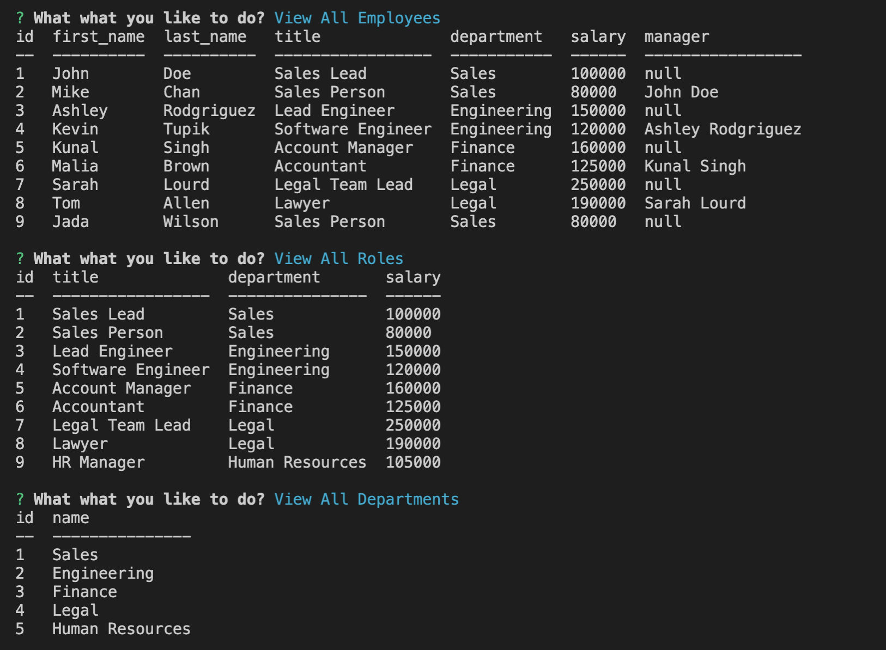

# employee-tracker

## Table of Contents 
1. [Description](#description)
2. [Usage](#usage)
3. [Visuals](#visuals)
4. [Resources](#resources)

## Author:

Safwan Islam

## Description
In this challenge, there is code which builds out a employee tracker in the terminal. The schema.sql and seeds.sql take care of the baseline data and the relationships between different data points. There are a few different options for the user. The user can view all employees, departments, and roles. If the user views all employees, they can see the id of the employee, their first and last name, role, department, salary, and manager if they have one. If the user chooses to view all roles, they can see the role's id, title, department, and salary. If the user chooses to view the departments, they are met with the department id and name. They can also add to each of those three categories, and can update the role of the employees. Overall, this application serves as an efficient way for a manager or owner of a business to see and change their personnel, and change their relevant info as needed.

## Usage
In order to start this code, the user should first run "mysql -u root" in order to get into the mysql framework, then run "source db/schema.sql" and "source db/seeds.sql" followed by "exit" in order to run the database. Then the user should run "npm install" in order to install all dependencies followed by "npm start" in order to start running the application. The user may need to install mysql2, inquirer, and console.table if those applications are not already installed within their directory.

## Visuals

## Resources
[Video Link](https://drive.google.com/file/d/13BSe9RFUKffXeSwAFpgFHx3Egyz5nqsz/view)

[GitHub Repository](https://github.com/saislam10/employee-tracker)

